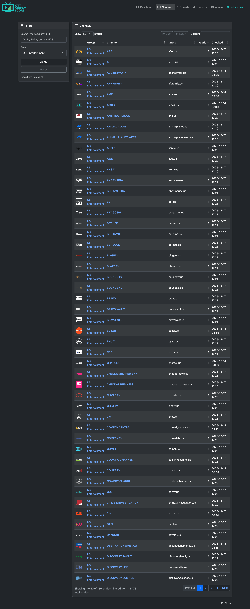
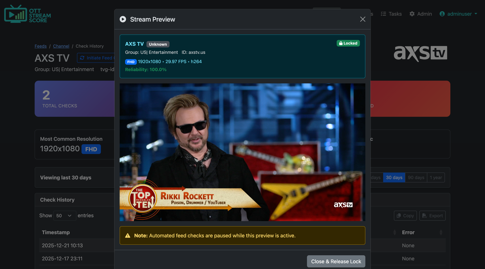
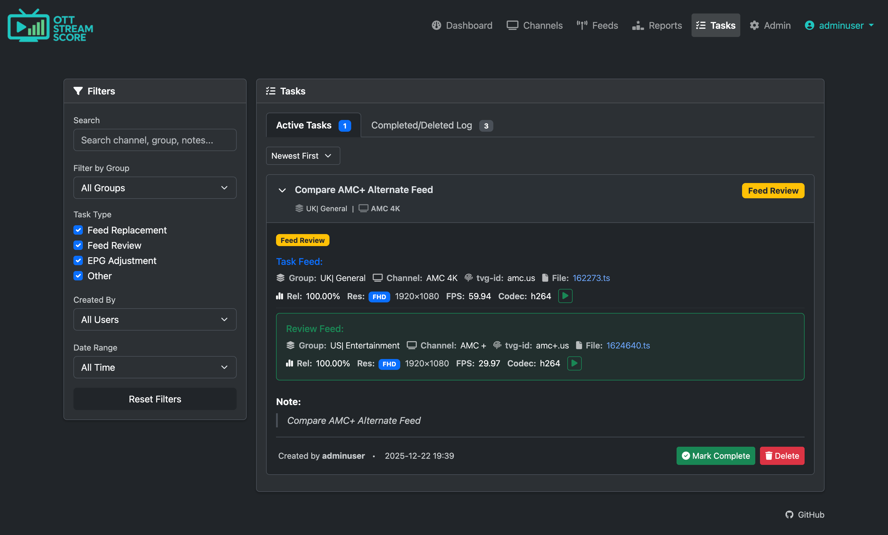

# OTT Stream Score

**Smart IPTV feed monitoring, quality tracking, and playlist optimization**  

OTT Stream Score is a comprehensive IPTV playlist management system that continuously monitors stream health, tracks quality metrics, identifies optimal feeds, and helps editors maintain high-quality playlists through intelligent recommendations and collaborative workflows.

---

## What Problem Does It Solve?

IPTV playlists are messy. The same channel appears dozens of times across different groups, regions, and providers. Some streams work reliably, others fail constantly. Manual testing is time-consuming and doesn't scale. You need data to make decisions.

**OTT Stream Score gives you that data.**

Instead of guessing which feed is best or manually testing streams, the system:
- Monitors all your feeds 24/7 and tracks their performance over time
- Ranks duplicates by reliability, resolution, and quality
- Suggests better alternatives from other regions/groups based on actual performance data
- Lets you compare programming schedules (EPG) and live streams to verify channels are truly identical
- Provides workflow tools for editors to systematically improve playlist quality
- Previews any stream in-browser without external tools

**Built for:**
- IPTV providers curating custom playlists
- Playlist editors maintaining large channel libraries
- Power users who want data-driven feed selection
- Teams collaborating on playlist optimization

---

## Core Features

### 📺 Playlist & EPG Management

**URL-Based Sync System**
- Import playlists directly from remote URLs (no file uploads)
- One-click credential rotation without re-downloading
- Automatic filtering to LIVE content only (excludes VOD)

**EPG Integration**
- Support for compressed formats (gzip, zip)
- Timezone-aware storage and display
- Rolling 4-day program window
- Compare schedules across similar channels to verify content matches

### 🔍 Intelligent Feed Monitoring

**24/7 Automated Checking**
- Smart scheduling: healthy feeds checked every 72 hours, failed feeds retried with backoff
- HTTP reachability testing
- Video quality analysis via FFprobe (resolution, FPS, codec)
- 7-day reliability scoring
- Lock mechanism prevents concurrent checks
- Batch processing for resource management

**Quality Metrics Tracked**
- Uptime and reliability percentage
- Resolution (4K → FHD → HD → SD)
- Frame rate (FPS)
- Video codec
- Historical performance data
- Check frequency and timing

### 📊 Feed Ranking & Comparison

**Composite Scoring Algorithm**
Feeds are ranked using weighted metrics:
1. **Reliability** (60%) - Uptime over 7 days, most critical factor
2. **Resolution** (25%) - Higher resolution preferred
3. **FPS** (15%) - Smoother playback preferred

**Multi-Feed Comparison**
- Side-by-side feed comparison with full metrics
- EPG schedule comparison to verify content matches
- Historical reliability charts
- Quick identification of best available source

### 🌐 Group Associations

**Cross-Regional Feed Discovery**
- Define associations by language, region, or content type
- Group prefixes together (e.g., US|, UK|, CA| = "English Speaking")
- Automatically discover similar channels across regions
- Find backup streams when primary feeds fail

**Smart Matching**
- Matches on tvg-id similarity (e.g., `CHAN.us` ↔ `CHANcanada.ca` ↔ `CHAN.uk`)
- Bidirectional matching algorithm
- Surfaces alternatives that might have different naming but same content
- Essential for finding redundant sources across provider groups

### 🎯 Group Audit System

**Category-Wide Optimization**
- Audit entire channel groups at once
- Analyze feed quality over custom date ranges (7/30/90 days, all time, custom)
- Get recommendations for better alternatives from other categories

**Smart Recommendations**
- Compares current feed vs. best available alternative
- Shows detailed performance metrics for both options
- Filters out suggestions you've already dismissed
- Bulk workflow for systematic playlist improvement

**Ignore Management**
- Dismiss recommendations that aren't relevant
- View all ignored suggestions
- Un-ignore feeds if circumstances change
- Prevents recommendation fatigue

### 📋 Task Management System

**Collaborative Workflow**
- Create tasks for feed replacements, reviews, or EPG adjustments
- Assign alternative feeds with full context
- Add notes explaining the change
- Track task completion history

### 🎬 Native Stream Player

**In-Browser Playback**
- Preview any stream without external tools
- Universal format support (MPEG-TS and HLS)
- Lock coordination prevents conflicts with automated checks
- Available throughout the interface (reports, history, channel pages)

### 📈 Reporting & Analytics

**Dashboard**
- System health overview
- Recent check activity
- Quick stats on feed performance
- Alerts for degraded feeds

**Detailed Reports**
- Dead feeds list with last check time
- Top performing feeds by reliability
- Quality distribution breakdown
- Per-group performance analysis
- Custom date range filtering

**Historical Data**
- Full check history for every feed
- Performance trends over time
- Resolution/FPS changes tracked
- Error patterns identified

### 👥 Multi-User Support

**Team Collaboration**
- Individual user accounts with secure authentication
- Login attempt monitoring and lockout protection
- Audit trail for all authentication events
- Account management controls (reset lockouts, view logs)

---

## How It Works

### 1. **Import Your Playlist & EPG**
Paste your M3U playlist URL and EPG URL. The system downloads, processes, and identifies all LIVE channels (filtering out VOD automatically). Duplicate channels are grouped by `tvg-id`.

**Strong recommendation:** Use a playlist with high EPG coverage.

OTT Stream Score uses `tvg-id` to identify duplicate channels. Poor or missing `tvg-id` values mean:
- Duplicates won't be grouped correctly
- Ranking becomes less effective
- Channel reports show incomplete data

**Benchmark:** Target >80% EPG coverage for your regions. Reference implementations achieve ~94% percent coverage.

### 2. **Automated Monitoring Begins**
A cron job checks feeds on a smart schedule:
- New/unknown feeds: checked immediately
- Healthy feeds: every 72 hours
- Failed feeds: progressive retry with backoff
- EPG updates: twice daily (midnight and noon)

### 3. **Data Accumulates**
Over days and weeks, the system builds a performance profile:
- Which feeds are reliable vs. flaky
- Which provide best quality
- Which fail consistently
- When problems occur

### 4. **Make Data-Driven Decisions**
Use the insights to optimize your playlist:
- **Group Audit**: Find better feeds for entire categories
- **Channel View**: Compare all sources for a specific channel
- **Associations**: Discover regional alternatives
- **Tasks**: Coordinate team changes with context and history
- **Reports**: Identify systematic problems across providers

---

## Installation & Setup

### Requirements
- PHP 8.1+ (PDO, cURL, mbstring, zip extensions)
- MySQL 5.7+ or MariaDB 10.2+
- FFmpeg/FFprobe
- Web server (Apache/Nginx)
- Cron access

  **⚠️ Important:** Panel owners must provision a unique subscriber account for OTT Stream Score. Individual users must use a second connection, or multi-connection account. OTT Stream Score monitors feeds 24/7 and will prevent you from watching streams simultaneously on a separate device and will result in false-positive failed stream reports.

### Installation

**See [INSTALL.md](INSTALL.md) for complete installation and upgrade instructions.**

---

## Screenshots

### Dashboard
System overview with feed health metrics and recent check activity

### Channel Management
Search and filter thousands of channels with advanced DataTables UI

### Feed Management
Monitor and sort feeds by reliability, quality, and performance metrics

### Channel Detail
Compare all feed sources for a channel with ranked quality scores

### Feed History
Track performance trends and reliability over time for any feed

### Reports
Audit channel groups and discover better alternatives across categories

### Native Stream Player
Preview streams in-browser with real-time quality metrics and status

### Task Management
Coordinate feed replacements and reviews with collaborative workflow tools

---

## Workflow Example

**Scenario**: You want to optimize your "US| Entertainment" group

1. **Navigate to Reports** → Select "US| Entertainment" → Choose date range (30 days)
2. **Review Recommendations**: System shows 15 channels with better alternatives available
3. **Compare Options**: Click on "Channel Name" to see current feed (SD, 75% reliable) vs. suggested feed (FHD, 100% reliable from "US| Other Group")
4. **Verify Content**: Check EPG schedules match to confirm it's the same channel. Preview both streams using the build-in player.
5. **Create Task**: Assign the replacement feed with note: "Upgrading to FHD source with better reliability"
6. **Team Reviews**: Another editor sees the task, previews both streams, approves the change
7. **Repeat**: Systematically improve all flagged channels

Result: Higher quality playlist backed by performance data, not guesswork.

---

## Technical Details

- **Backend**: PHP 8.1+ with PDO (MySQL/MariaDB)
- **Frontend**: Bootstrap 5, jQuery, DataTables
- **Video Analysis**: FFprobe (FFmpeg suite)
- **Streaming**: HLS.js and mpegts.js for in-browser playback
- **Scheduling**: Standard cron jobs
- **Security**: Password hashing (bcrypt), CSRF protection, session management

**See [INSTALL.md](INSTALL.md) for complete technical details.**

---

## Configuration

All configuration managed via Admin panel after installation:

- **Stream host** - Base URL for authenticated streams
- **Timezone** - Application timezone
- **Batch size** - Feeds per cron run
- **Lock duration** - Concurrent execution prevention
- **Recheck intervals** - How often to check healthy vs failed feeds
- **Sync playlist** - Sync a new playlist with changes
- **Update stream credentials** - Change the authorized subscriber credentials for the stored playlist
- **Database credentials** - Update connection settings
- **User management** - Create and manage user accounts
- **Security monitoring** - View failed login attempts and reset lockouts

---

## Security

**Built-in protections:**
- Session-based authentication
- CSRF protection on all forms
- Rate limiting (5 attempts / 15 minutes per user and IP)
- Password hashing (bcrypt)
- Input sanitization
- SQL injection prevention (prepared statements)
- Failed login attempt logging
- Account lockout protection

**See [SECURITY.md](SECURITY.md) for hardening recommendations.**

## License

---

## Support

- **Documentation**: [GitHub Wiki](https://github.com/ottstreamscore/ott-stream-score/wiki)
- **Issues**: [GitHub Issues](https://github.com/ottstreamscore/ott-stream-score/issues)
- **Discussions**: [GitHub Discussions](https://github.com/ottstreamscore/ott-stream-score/discussions)

---

**Current Version:** 2.1
**Release Date:** December 2025  
**Previous Version:** 2.0 (December 2025)