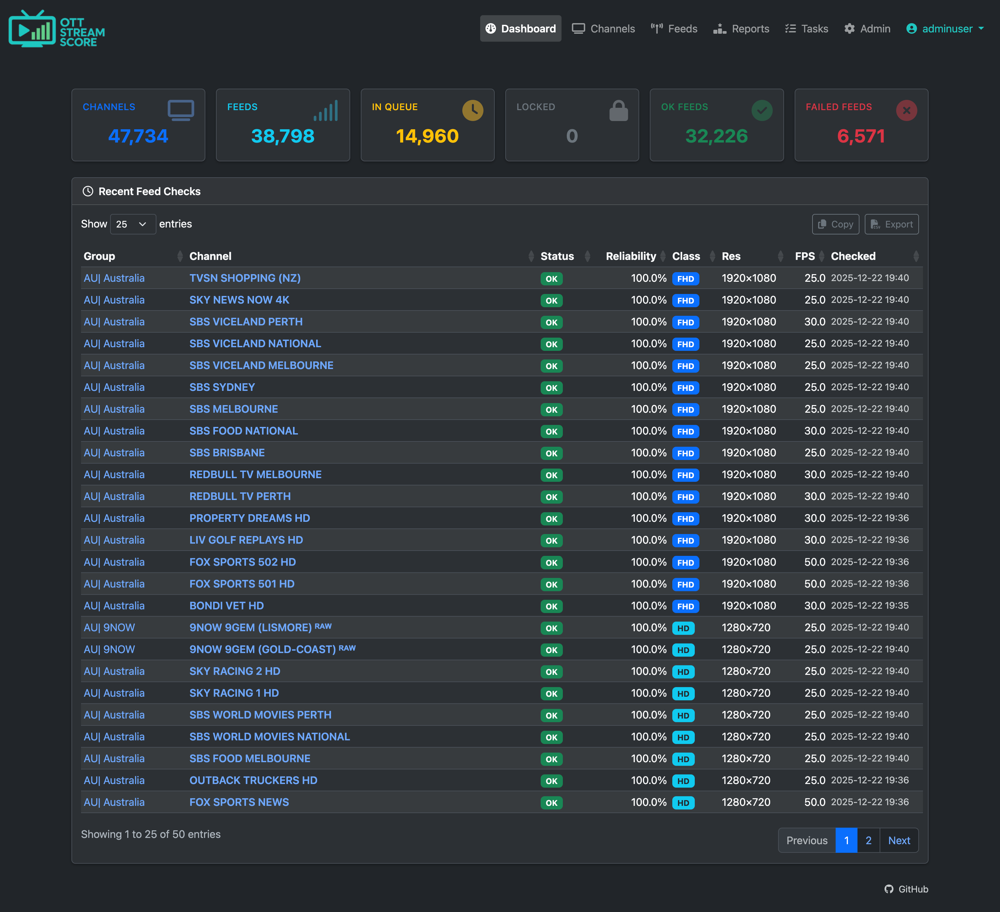
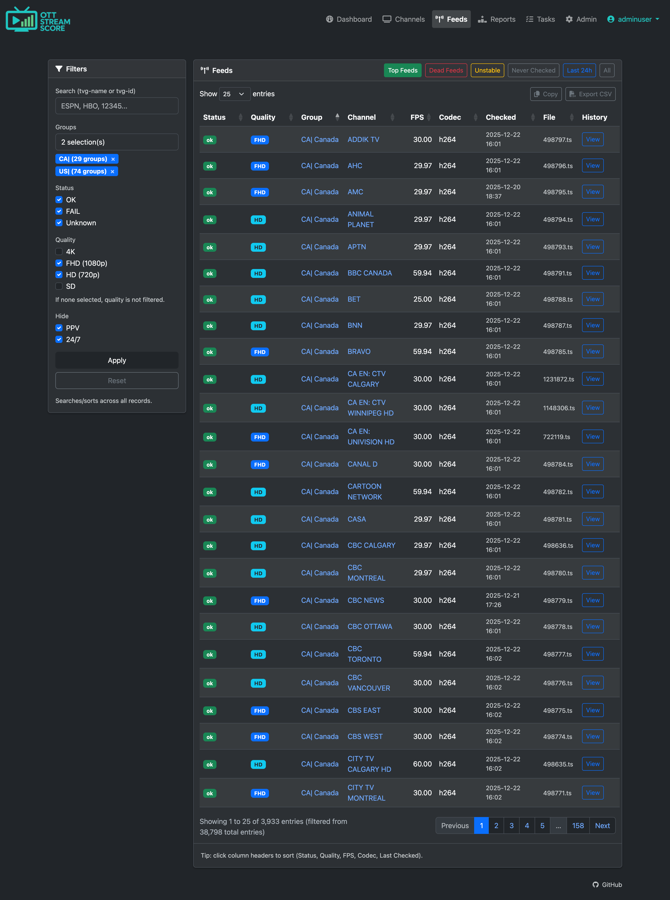
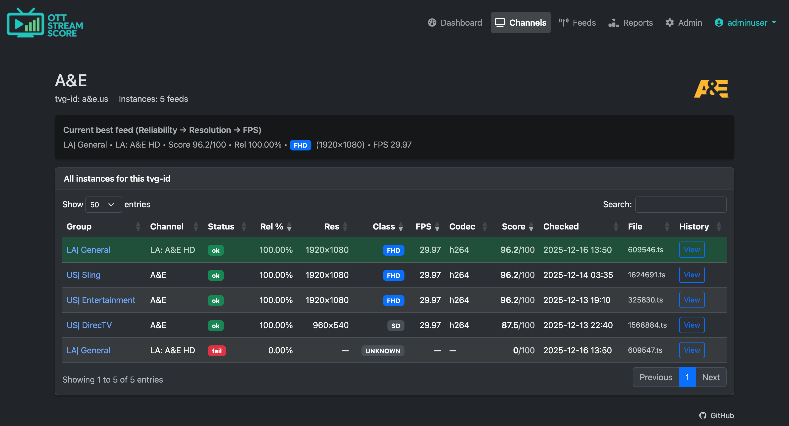

# Stream Score IPTV Feed Monitor + Ranker

A web application that imports LIVE channels from M3U playlists, continuously monitors stream health and quality, and ranks duplicate feeds to help you identify the best feed for each channel.

## Overview

This tool is designed for:

- **Premium IPTV resellers** who want to monitor and continuously improve feed quality
- **Individual IPTV users** who prefer a data-driven approach to selecting the best duplicate feeds

> **Note:** If you have a panel/editor, create a dedicated subscriber account for this script, as it will monitor streams continuously 24/7.

## Problem Statement

Many IPTV playlists contain duplicate channels (multiple streams for the same channel identified by `tvg-id`). This tool doesn't remove duplicates — instead, it ranks them so you can select the best feed at any point in time.

### Ranking Criteria (in order of priority)

1. **Reliability** (most important)
2. **Resolution class** (4K → FHD → HD → SD → Unknown)
3. **FPS**

## Requirements

### System Requirements

**PHP:**
- PHP 8.0 or newer (recommended)
- Required extensions: `pdo`, `pdo_mysql`, `json`
- Recommended extensions: `mbstring`, `curl`

**Database:**
- MariaDB 10.4+ or MySQL 8.0+
- InnoDB engine
- Charset: `utf8mb4`

**Media Tools (recommended):**
- `ffprobe` installed and available in PATH
- `ffmpeg` (optional)

> **Note:** If `ffprobe` is not available, basic reachability checks will still work, but codec, resolution, and FPS data will not be available.

**Web Server:**
- Apache or Nginx
- **Strongly recommended:** Password-protect the application directory

### EPG Requirements (Strong Recommendation)

For best results, run your playlist through an IPTV Editor (or similar panel/editor) with high EPG coverage.

**Why EPG matters:**
- The tool uses `tvg-id` as the primary unique identifier for duplicates
- Missing or inconsistent `tvg-id` values reduce duplicate tracking accuracy
- Poor EPG coverage leads to messy channel grouping

**Benchmark:**
- Target: >80% EPG coverage for your regions
- Reference implementation: ~94% coverage across North America and Europe

## Features

### Import Capabilities

**LIVE channels only** — Only playlist URLs containing `/live/` are imported and monitored. VOD entries (movies and series) are ignored.

Each LIVE entry stores:
- `tvg-id` (primary duplicate identifier)
- `tvg-name` (channel name)
- `tvg-logo` (logo URL)
- `group-title` (category/group)
- Feed URL (full URL + display-friendly .ts filename)
- Import timestamp

### Feed Monitoring

When feeds are checked, the system records:
- Reachable vs dead status
- HTTP response metadata
- Video codec
- Resolution (width × height)
- Resolution class (4K / FHD / HD / SD / Unknown)
- FPS
- Check timestamp
- Any errors encountered

### Core UI Pages

- **Dashboard** (`index.php`) - High-level summary and navigation
- **Channels** (`channels.php`) - Server-side DataTables view with filtering by group and search by `tvg-name` or `tvg-id`
- **Single Channel** (`channel.php?id=...`) - View all instances of a channel's `tvg-id` across groups with ranked feeds
- **Feeds** (`feeds.php`) - Server-side DataTables view with sorting and filtering by status, group, resolution, FPS, and last checked time
- **Reports** (`reports.php`) - Aggregations and quick filters (top channels, dead feeds, quality breakdowns)
- **Process Playlist** (`process_playlist.php`) - Import M3U files (safe to run repeatedly)

## Installation

1. Upload the application to a directory (e.g., `/ott/`)
2. Place `config.php` in that directory
3. Edit `config.php` and set your database and environment variables
3. Run `install_db.php` once to create database tables
4. Upload your M3U playlist to the same directory as the script
5. Import the playlist using `process_playlist.php`
6. Configure cron to execute `cron_check_feeds.php`

## Configuration

Edit the `config.php` file in application directory with the following values:

**Stream/Host:**
```php
STREAM_HOST
```

**Database:**
```php
DB_HOST
DB_PORT
DB_NAME
DB_USER
DB_PASS
DB_CHARSET
```

**Application Behavior:**
```php
APP_TZ                    // Application timezone
BATCH_SIZE                // Feeds processed per cron run
LOCK_MINUTES              // Prevent concurrent cron runs
OK_RECHECK_HOURS          // Recheck interval for healthy feeds
FAIL_RETRY_MINUTES_MIN    // Minimum retry interval for failed feeds
FAIL_RETRY_MINUTES_MAX    // Maximum retry interval for failed feeds
```

## Scheduling (Cron)

Feed checking is handled by a cron-driven worker script. **This is required** — feed checking does not happen via the web UI.

### Cron Setup

The cron job must execute:
```bash
cron_check_feeds.php
```

**Requirements:**
- Must run via PHP CLI, not HTTP
- Each run processes up to `BATCH_SIZE` feeds
- Uses lock mechanism (`LOCK_MINUTES`) to prevent concurrent runs
- Safely resumes on next execution

### Recommended Schedule
```bash
# Every 2 minutes (default)
*/2 * * * * /usr/bin/php /path/to/cron_check_feeds.php

# Every 1 minute (aggressive monitoring)
* * * * * /usr/bin/php /path/to/cron_check_feeds.php

# Every 5 minutes (large playlists or limited resources)
*/5 * * * * /usr/bin/php /path/to/cron_check_feeds.php
```

## Security

⚠️ **Important Security Measures:**

1. **Password-protect the application directory**
2. **Delete `install_db.php` after setup**
3. **Do not publicly expose playlist files or internal reports**

## License

Do what you wish with this. Offered with no warranty.

## Support

Call a friend.

## Screen Captures



