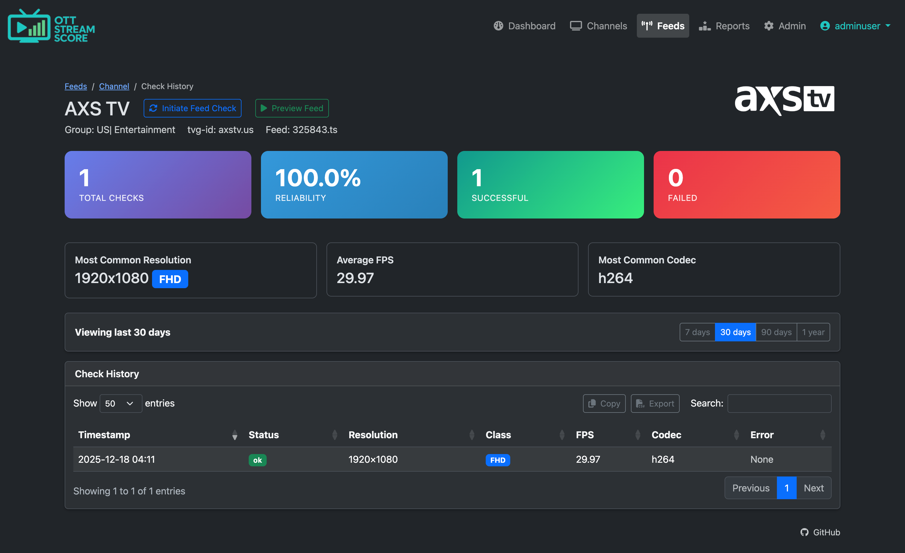
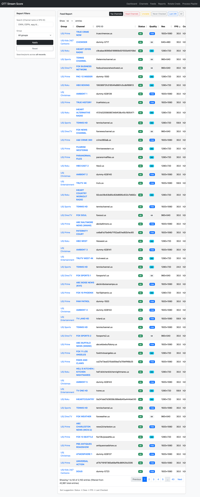

# OTT Stream Score

**Smart IPTV feed monitoring and ranking system**

OTT Stream Score continuously monitors your IPTV streams, tracks reliability and quality metrics, and helps you identify the best feed for each channel from your M3U playlist.

---

## What It Does

Many IPTV playlists contain duplicate channels – multiple streams for the same channel. Instead of randomly picking one or manually testing each, OTT Stream Score:

- **Monitors** all your LIVE streams 24/7
- **Tracks** reliability, resolution, FPS, and quality metrics
- **Ranks** duplicate feeds so you always know which is best
- **Reports** stream health and historical performance
- **Audits** entire channel groups to identify better feed alternatives across categories
- **Manages** user access with secure authentication and account controls

**Perfect for:**
- IPTV resellers managing a custom playlist through an editor
- Power users who want data-driven feed selection
- Content curators optimizing feed quality across categories
- Anyone tired of manually testing duplicate streams

> **⚠️ Important:** Panel owners should provision a unique subscriber account for OTT Stream Score. Do not use your personal viewing account – the software monitors streams continuously and will prevent you from watching streams simultaneously on a separate device. If you are an individual user, use a multi-connection account, or a second connection/account.

---

## How It Works

### 1. Import Your Playlist
Upload your M3U playlist and OTT Stream Score automatically:
- Identifies all LIVE channels (ignores VOD)
- Groups duplicates by `tvg-id`
- Creates a monitoring schedule

### 2. Continuous Monitoring
A background worker (cron job) checks feeds on a smart schedule:
- Healthy feeds: Checked every 72 hours (configurable)
- Failed feeds: Progressive retry with backoff
- Tracks: reachability, resolution, FPS, codec, errors

### 3. Intelligent Ranking
Feeds are scored and ranked by:
1. **Reliability** (uptime over last 7 days) - *most important*
2. **Resolution** (4K → FHD → HD → SD)
3. **FPS** (frames per second)

### 4. Visual Reports
- Dashboard: System overview and recent activity
- Channels: Browse all channels with ranked feeds
- Feeds: Detailed feed list with filtering
- Reports: Dead feeds, top performers, quality breakdowns
- Group Audit: Analyze entire categories and find better alternatives
- History: View check history for any feed

---

## Key Features

### Smart Monitoring
- **LIVE streams only** – Automatically filters out VOD content
- **Adaptive scheduling** – Healthy feeds checked less often, failed feeds retried progressively
- **Lock mechanism** – Prevents concurrent runs and resource conflicts
- **Batch processing** – Configurable batch size for load management

### Quality Metrics
- HTTP reachability and response codes
- Video codec detection (via FFprobe)
- Resolution detection (width × height)
- FPS measurement
- Reliability scoring (7-day window)

### User Interface
- **Server-side DataTables** – Fast filtering and sorting even with thousands of feeds
- **Group filtering** – Browse by category/group/feed/channel
- **Search** – Find channels by name or EPG ID (tvg-id)
- **Historical data** – View past check results for any feed/channel
- **Dark mode default** – Comfortable viewing

### Group Audit
- **Category-wide analysis** – Audit all channels in a group at once
- **Smart recommendations** – Find better feeds from other categories based on historical performance
- **Date range filtering** – Analyze feed quality over specific time periods (7 days, 30 days, 90 days, all time, custom)
- **Visual indicators** – Instantly see which channels are optimal (green), need review (yellow), or lack data (gray)
- **Ignore system** – Dismiss recommendations you don't want and manage ignored feed suggestions
- **Feed comparison** – View detailed stats and history for current vs. recommended feeds
- **Bulk optimization** – Quickly identify multiple channels that could use better alternatives

This helps you systematically improve feed quality across your entire playlist by finding the best available source for each channel, even if it exists in a different category.

### User Management
- **Multi-user support** – Create accounts for team members with individual credentials
- **Security monitoring** – Track login attempts and identify suspicious activity
- **Account controls** – Reset lockouts, view login logs, manage user access
- **Audit trail** – Failed login attempt logging with IP addresses and timestamps

Teams can collaborate securely without sharing passwords, and the team has full visibility into account activity.

---

## Why EPG Matters

**Strong recommendation:** Use a playlist with high EPG coverage.

OTT Stream Score uses `tvg-id` to identify duplicate channels. Poor or missing `tvg-id` values mean:
- Duplicates won't be grouped correctly
- Ranking becomes less effective
- Channel reports show incomplete data

**Benchmark:** Target >80% EPG coverage for your regions. Reference implementations achieve ~94% across North America and Europe.

---

## Quick Start

### Requirements
- PHP 8.0+
- MySQL 5.7+ or MariaDB 10.2+
- FFmpeg/FFprobe (for quality metrics)
- Web server (Apache/Nginx)

### Installation

**See [INSTALL.md](INSTALL.md) for complete installation and upgrade instructions.**

Quick summary:
```bash
# Clone repository
git clone https://github.com/ottstreamscore/ottstreamscore /path/to/webroot
cd /path/to/webroot

# Run setup
php setup.php

# Follow the wizard to configure database and create admin account
```

### Setup Cron Job

Feed monitoring requires a cron job:
```bash
*/5 * * * * cd /path/to/installation && php cron_check_feeds.php >> /dev/null 2>&1
```

Adjust frequency based on your playlist size and server capacity.

---

## Documentation

- **[INSTALL.md](INSTALL.md)** - Installation and upgrade guide
- **[SECURITY.md](SECURITY.md)** - Security best practices
- **[RELEASE_NOTES_1.4.md](RELEASE_NOTES_1.4.md)** - Version 1.4 release notes

---

## Screenshots

### Dashboard
High-level metrics and recent feed checks


### Feed List
Browse and filter all monitored feeds


### Channel Detail
View all feeds for a channel, ranked by quality


### Feed History
View all feeds for a channel, ranked by quality


### Reports
Analyze entire categories and find better feed alternatives


---

## Technical Details

### Database Schema
- **channels** - Channel metadata
- **feeds** - Feed URLs and current status
- **channel_feeds** - Many-to-many relationship (supports duplicates)
- **feed_checks** - Historical check data
- **feed_check_queue** - Monitoring schedule
- **group_audit_ignores** - User-dismissed feed recommendations
- **settings** - Application configuration
- **users** - Authentication and user management
- **login_attempts** - Security logging and rate limiting

### Feed Checking Logic
1. Queue selects next batch of due feeds
2. FFprobe checks stream metadata
3. Results recorded to database
4. Reliability score calculated (168-hour window)
5. Next check scheduled based on result

### Reliability Calculation
- Rolling 7-day (168-hour) window
- Percentage of successful checks vs total checks
- Weighted recent checks slightly higher
- Displayed as percentage (0-100%)

---

## Configuration

All configuration managed via Admin panel after installation:

- **Stream host** - Base URL for authenticated streams
- **Timezone** - Application timezone
- **Batch size** - Feeds per cron run
- **Lock duration** - Concurrent execution prevention
- **Recheck intervals** - How often to check healthy vs failed feeds
- **Sync playlist** - Sync a new playlist with changes
- **Update stream credentials** - Change the authorized subscriber credentials for the stored playlist
- **Database credentials** - Update connection settings
- **User management** - Create and manage user accounts
- **Security monitoring** - View failed login attempts and reset lockouts

---

## Security

**Built-in protections:**
- Session-based authentication
- CSRF protection on all forms
- Rate limiting (5 attempts / 15 minutes per user and IP)
- Password hashing (bcrypt)
- Input sanitization
- SQL injection prevention (prepared statements)
- Failed login attempt logging
- Account lockout protection

**See [SECURITY.md](SECURITY.md) for hardening recommendations.**

---

## Troubleshooting

### Common Issues

**Blank page after login**
- Check `php_errors.log` in application directory
- Verify all PHP extensions are installed
- Ensure database connection is working

**No feeds being checked**
- Verify cron job is running
- Check cron execution: `grep CRON /var/log/syslog`
- Review queue: `SELECT * FROM feed_check_queue LIMIT 10`

**Database connection failed**
- Verify credentials in `.db_bootstrap`
- Test connection: `mysql -h host -u user -p database`
- Check database user permissions

**Account locked out**
- Wait 15 minutes for automatic unlock
- Or admin can reset via User Management tab
- Or manually: `DELETE FROM login_attempts WHERE username = 'username';`

**See [INSTALL.md](INSTALL.md) for detailed troubleshooting.**

---

## Contributing

Contributions welcome! Please:
1. Fork the repository
2. Create a feature branch
3. Make your changes
4. Submit a pull request

---

## License

[](http://unlicense.org/)

---

## Support

- **Issues:** [GitHub Issues](https://github.com/ottstreamscore/ottstreamscore/issues)
- **Documentation:** [INSTALL.md](INSTALL.md) | [SECURITY.md](SECURITY.md)
- **Community:** Submit issues or pull requests

---

**Current Version:** 1.4  
**Release Date:** December 2025  
**Previous Version:** 1.3 (December 2025)